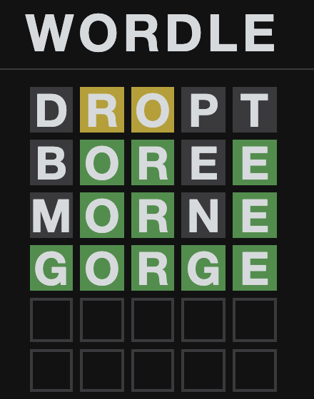

# WORDLE Solver in Rust

A solver to the [WORDLE puzzle](https://www.powerlanguage.co.uk/wordle/) written in Rust.
It uses a 5-letters word database derived from https://github.com/dwyl/english-words/blob/master/words_alpha.txt.

## Getting started

As any usual Rust project `cargo build` is enough to build this project.

Hints are provided as 5 letter words.

- "-" means the letter is not present anywhere remaining in the word
- Upper case means the letter in the right position
- Lower case means the letter in wrong position

An example using it with the result below:



```
$ cargo build && ./target/debug/wordle-solver-rs
    Finished dev [unoptimized + debuginfo] target(s) in 0.03s
Welcome to the WORDLE solver!
Suggested word: dropt
Is the word in the list? (y) yes, (n) no: y
Insert hint: -ro--
Number of candidates: 553
Suggested word: boree
Is the word in the list? (y) yes, (n) no: y
Insert hint: -OR-E
Number of candidates: 21
Suggested word: morne
Is the word in the list? (y) yes, (n) no: y
Insert hint: -OR-E
Number of candidates: 14
Suggested word: gorge
Is the word in the list? (y) yes, (n) no: y
Insert hint: GORGE
Congratulations! 🎉
```

You can also set a start word by passing it via the `--start <word>` or `-s <word>` arguments.

# Improvements needed

- Because we are using unordered sets here, the iterators don't necessarily provide the same order when executing the
  solver with the same input. Solving this could make our life easier to adding tests.
- The exclusion of candidates from the wrong positions can be improved if we keep the history of previous incorrect positions. Currently it gets candidates based only on the last hint. However this is already working pretty ok.